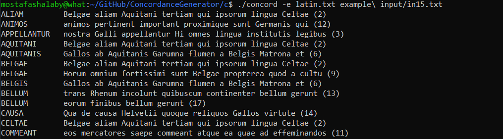

# ConcordanceGenerator
A keyword-out-of-context generator, implemented both in C and Python. I created this project to test the difference in speed between Python and C. Here are my findings:

|              | **Python** | **C**      |
|--------------|------------|------------|
| **You**      | Loves life | Hates life |
| **Computer** | Hates life | Loves life |

# What is a keyword-out-of-context concordance?

A concordance is an alphabetical list of key words found in a text or a collection of texts. A keyword-out-of-context concordance specificially seperates the word and the sentence it is found in, side by side. The concept originated in the study of religious texts like the bible, to allow for in-depth study.


Its like a formal, minimalist mind map.

# How to use

1. Clone the repo
2. Navigate to the `c` or `python` folder

3. **If you want to run the C implementation**:
   1. Run in a Linux environment or WSL so you can use `make`
   2. Run `make` to compile the code
   3. After it is compiled, simply run:
      ```
      ./concord <input file>
      ```
      or, if you want to exclude words:
      ```
      ./concord -e <words-to-exclude file> <input file>
      ```

4. **If you want to run the Python implementation**:
   1. Simply run:
      ```
      python concord.py <input file>
      ```
   2. Or, if you want to exclude words:
      ```
      python concord.py -e <words-to-exclude file> <input file>
      ```

# Feature Comparison between Implementations
| Feature               | C Implementation                              | Python Implementation                         |
|-----------------------|-----------------------------------------------|-----------------------------------------------|
| **File Handling**      | Manual, uses `fopen()`, `getline()`.          | Simpler with `open()`, `split()`.             |
| **Data Structures**    | Linked lists, manual memory management.       | Lists, automatic memory management.           |
| **String Manipulation**| Manual (`strtok_r`, custom lowercase function)| Uses regular expressions (`re`).              |
| **Keyword Sorting**    | Manual insertion sort with linked lists.      | Built-in `sort()` for lists.                  |
| **Output Formatting**  | Manually formats output, checks for duplicates| Formats output easily with `str.format()`.    |
| **Memory Management**  | Manual (free linked lists with `free_list()`).| Automatic garbage collection.                 |
| **Error Handling**     | Manual error checking (file opening, etc.).   | Exception handling with `try-except`.         |

# TL;DR
C offers low-level control, suitable for systems where fine-grained control of memory and performance is necessary.

Python is easier to implement, more concise, and handles memory, string manipulation, and file I/O automatically, making it more user-friendly and less error-prone for text analysis tasks.